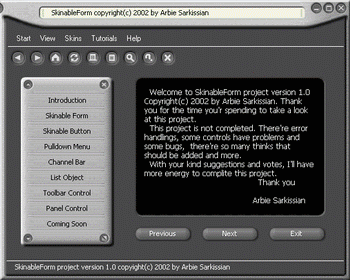



## SkinnableForm ver 1\.1 with 16 skins\!\!\!

### Description

This is a new version of Skinnable Form project with 16 skins and some bugs fixed. This project gives your VB project the ability of changing skins easy as it can possible. Now beside rectangle forms you can have rounded and polygon forms.
 
### More Info
 

             |
---                |---
**Submitted On**   |2002-11-08 12:43:30
**By**             |[Arbie Sarkissian](https://github.com/Planet-Source-Code/PSCIndex/blob/master/ByAuthor/arbie-sarkissian.md)
**Level**          |Advanced
**User Rating**    |4.9 (562 globes from 115 users)
**Compatibility**  |VB 6\.0
**Category**       |[Miscellaneous](https://github.com/Planet-Source-Code/PSCIndex/blob/master/ByCategory/miscellaneous__1-1.md)
**World**          |[Visual Basic](https://github.com/Planet-Source-Code/PSCIndex/blob/master/ByWorld/visual-basic.md)
**Archive File**   |[SkinnableF14967011132002\.zip](https://github.com/Planet-Source-Code/arbie-sarkissian-skinnableform-ver-1-1-with-16-skins__1-40685/archive/master.zip)

